# crackme0x04 reversing

## 프로그램 실행
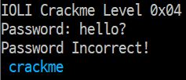
먼저 프로그램을 실행한 모습이다.  
첫 문장과 Password 입력 메시지가 출력되고, 임의의 password를 입력하면 password 정답 여부가 출력되고 종료된다.  

## gdb 디버깅

### main
gdb로 실행하여 main부터 시작해보면  
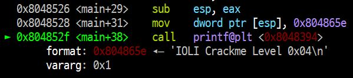  
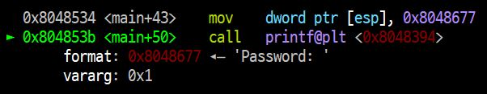  
위처럼 두번의 printf가 나오고, 더 내려가보면  
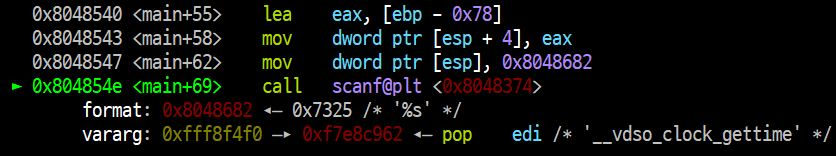  
scanf가 나온다.  
입력 후에 더 내려가보면  
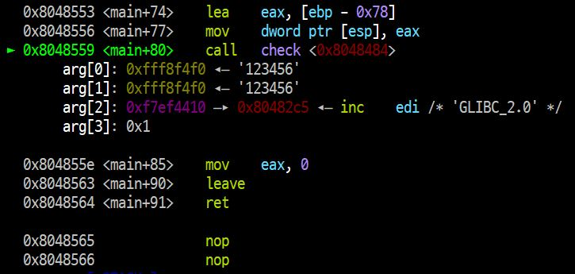  
위처럼 check함수가 나오고, 아래는 더이상 실행할 것이 없는 것으로 보아 check 함수 내부에서 비밀번호를 check하는 것 같아 <code> si </code> 명령어로 내부로 들어가본다.  

### check
check함수에서 들어가 코드를 실행하다보면  
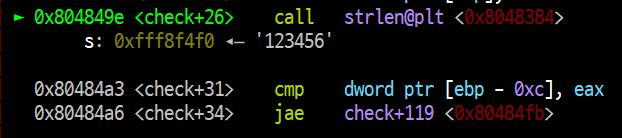  
위처럼 strlen함수가 나오는데, 여러번 시도 결과 입력한 password의 길이를 %eax에 return하는 것을 알아낼 수 있다.  
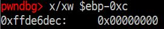  
strlen함수 아래에서는 $ebp-0xc의 값과 %eax를 비교하는데, $ebp-0xc = 0 < %eax = 6이므로 check+119로 jump하지 않는다.  
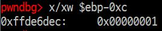  
이후 코드를 따라가 보면서 알아본 겨로가 check 내부에 Loop문에서 1씩 증가시키는 counter 역할을 하는 변수임을 알 수 있었다.  
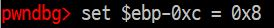  
이 branch에서 check+119로 가면 어떻게 되는지 알아보기 위해 $ebp-0xc의 값을 %eax보다 크게 해주고 check+119로 가보니
  
password가 틀리다고 한다.  
이로써 password는 문자의 길이만큼 반복하기 전에 조건을 만족해야 함을 알 수 있다.  

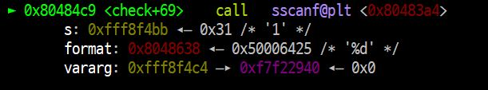  
더 내려가보면 sscanf함수가 나오는데, 입력한 character를 정수로 변환하여 저장한다. 이 값을 아래에서 비교한다.

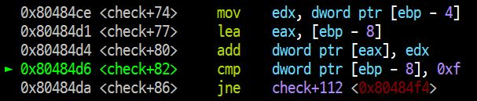  
또 한번의 cmp와 jump가 나오는데,  
레지스터를 분석해보면 $ebp-8에 %edx를 더하고 0xf와 비교하여 같으면 check+112로 간다.

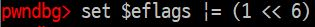  
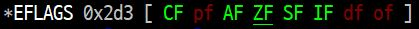  
그래서 일단 가봤다.  
Zero Flag를 1로 바꿔 Jump하도록 설정하여 가보니  
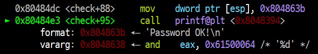  
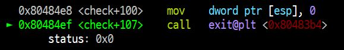  
password가 맞았다는 문구와 함께 프로그램이 종료된다.  

### 정리
흐름대로 가다보니 정신없이 썼는데, 요약해보면  
1. check 함수 내에서 password 확인
2. check 함수 내에서 strlen만큼 반복하며, strlen번 내에서 조건을 만족해야 함
3. 조건은 sscanf로 읽은 숫자의 합들이 15가 되어야 함

위의 내용을 알 수 있다.  
따라서 비밀번호는 앞에서부터 한 자리씩 더해 정확히 15를 만들 수 있는 모든 숫자이다.