# crackme0x05 reversing

## 프로그램 실행
[crackme0x04](crackme0x04.md)와 같은 방식이므로 설명하지 않겠다.

## gdb 디버깅

### main
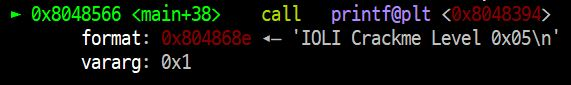
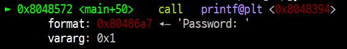  
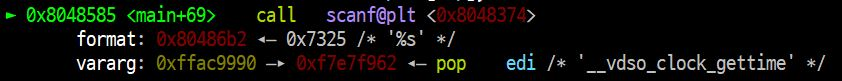  
crackme0x04와 마찬가지로 두번의 print 이후 입력을 받는다.  
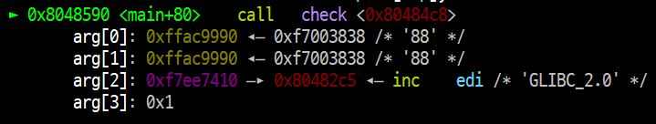  
내려가보면 check가 있고, 이 내부에서 password를 확인한다.

### check
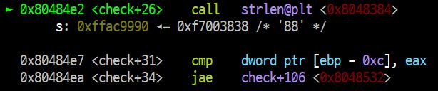  
입력받은 string의 길이를 %eax에 저장하고,  
0으로 초기화 되고 loop가 진행 될 때 마다 1씩 증가하는 값이 $edp-0xc에 저장되어 있어  
string의 길이 만큼 반복하는 loop문이다.  
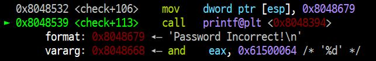  
check+106으로 jump 해보면, string 길이만큼 반복해도 조건을 만족하여 loop를 벗어나지 못하면 fail이다.

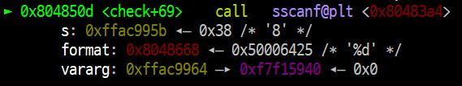  
더 내려가보면 sscanf로 입력받은 string의 한 자리를 정수로 전환한다.  
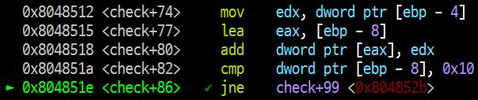  
그리고 해당 값을 [$ebp-8]에 더해 0x10(=16)과 같은지 확인하여 같지 않다면 check+99로 jump한다.  
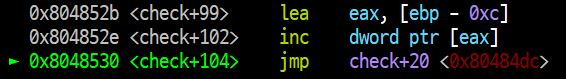  
조건을 만족하면 counter인 $ebp-0xc값을 1증가시키고 check+20으로 돌아가는 loop가 진행된다.  

조건을 만족하고 jump하지 않는다면  
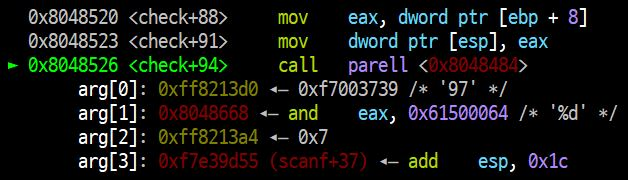  
check+88로 가고, parrel함수를 호출한다.  
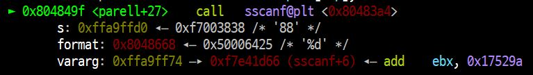  
parrel에서는 입력값을 숫자로 변환하여 0xffa9ff74에 저장한다.
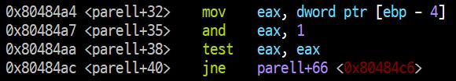  
$eax에 $ebp-4 (위의 sscanf의 return값이 저장된 곳이 여기다)값을 넣고,  
1과 AND연산하여 마지막 bit만 남기고,  
test 연산을 하여 마지막 bit가 1인지 확인함으로써 이 입력값이 짝수인지 홀수인지 구별할 수 있다.  

- 짝수일 때 ZF = 1이며 jump하지 않는다. 이 경우가 password가 성공하는 경우이다.  
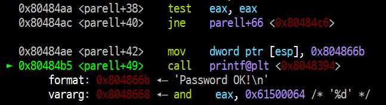

- 홀수일 때 ZF = 0이며 parell+66으로 jump하여 함수에서 나간다.
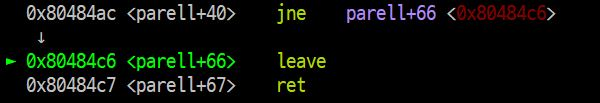  
이후에는 check내의 loop를 돌다가 strlen값을 넘어 fail될 것이다.