# bomb 해제

Bomb 파일은 code를 reversing 하여 비밀번호를 알아내고, 해당 비밀번호를 입력하여 폭탄을 해체하는 reversing 연습용 파일이다.  
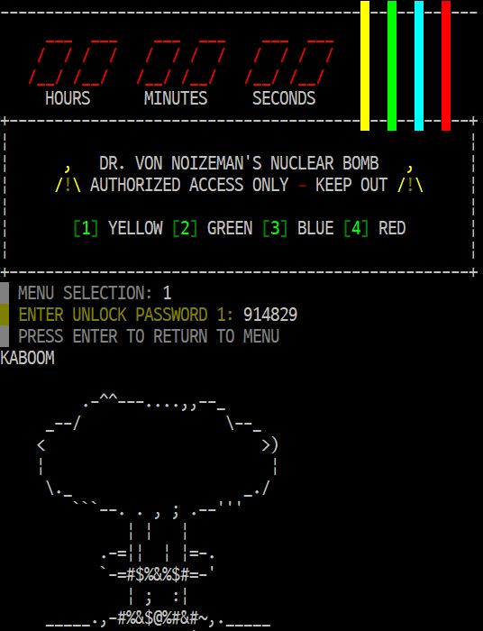  
실행하면 위처럼 폭탄 모양이 나오고, 노란색 선부터 빨간색 선까지 잘라내면 해체가 되며, 만일 각 선마다 입력한 값이 틀리면 폭탄은 터진다.  
~~시간도 안가는데, 그냥 놔두면 안터지고 좋을텐데...~~  

지구를 구하기 위해서는 이 핵폭탄이 터지게 둬서는 안된다.  
당장 해체하러 가보자.

## Yellow

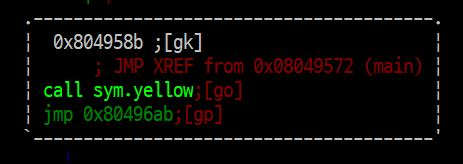  
bomb는 선택지에 따라 해당 함수로 들어가는 구조이며 yellow를 분석하기 위해 yellow로 들어가봤다.

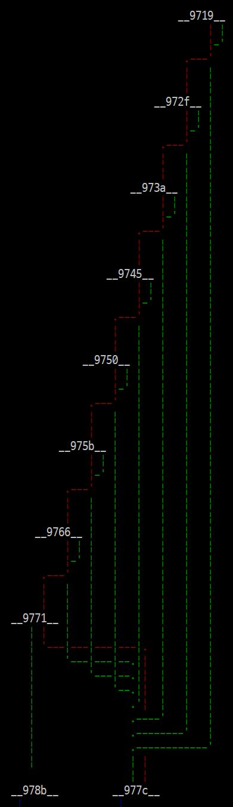  
위의 사진은 yellow 함수의 전체적인 구조이다.  
단계별로 있고, 각 단계에서 한번이라도 어긋나면 한 곳으로 jump하는 전형적으로 간단한 비밀번호 문제로 예상된다.  

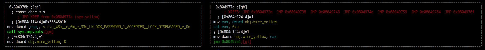  
위의 978b, 977c 함수들이다.  
obj.yellow가 해결 여부를 저장하는 것 같은데, 978b가 0으로 바꾸는 해제하는 분기이고, 977c가 1로 set하는 실패 분기이다.

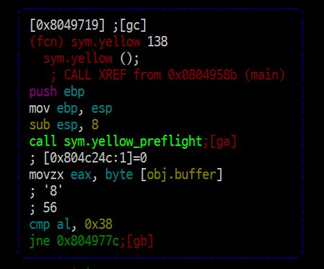  
buffer에 저장된 값을 byte단위로 읽어 '8'과 비교하여 같지 않으면 0x804977c로 이동한다.  
0x804977c는 위의 977c라고 말한 함수로, 실패이다. 첫 byte가 '8'이면 되는 것이다.  
같은 방식으로 아래에 총 8개의 확인 함수가 따라온다.  
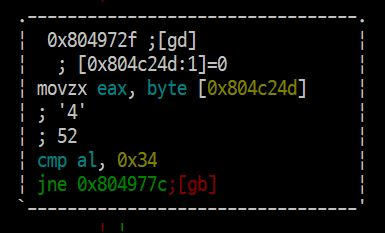
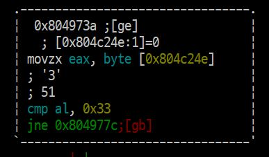

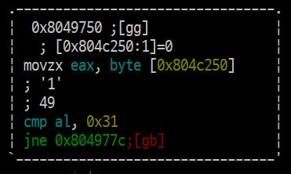
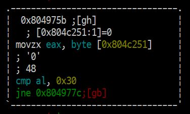
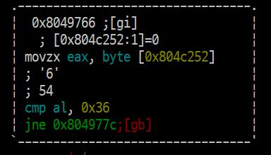
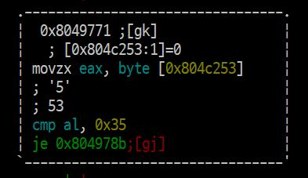  
위의 함수들은 주솟값을 0x804c24c부터 byte단위인 주소를 1씩 증가시켜 비교하는 것으로 보아, 앞에서부터 한글자씩 차례대로 비교하는 글자와 같으면 넘어가는 형식이다.  
따라서 그대로 글자를 따보면 <code>84371065</code>가 나온다.  

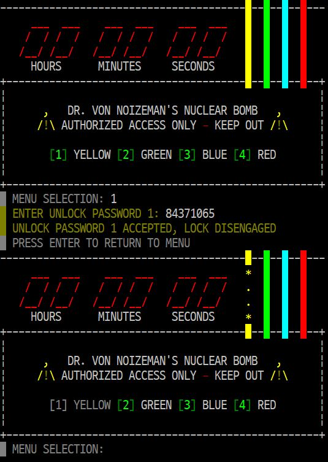  
그대로 입력해본 결과 노란색 선을 해제할 수 있었다.  

~~지구를 구하는데 한발짝 다가섰다.~~