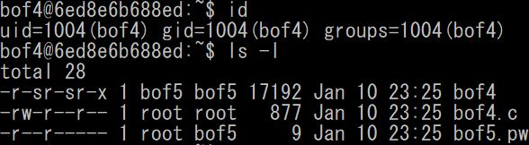
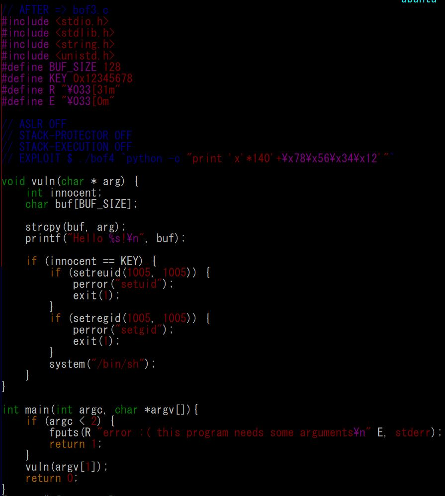
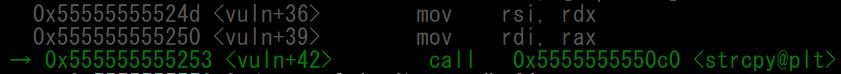
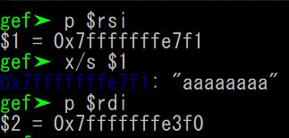
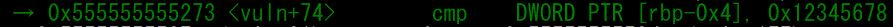
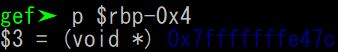
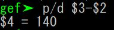
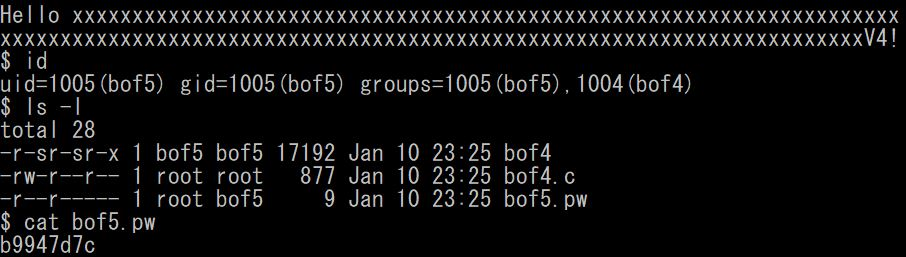

# bof4

## 개요

  
bof4로 접속하면 home directory에 <code>bof4</code>, <code>bof4.c</code> 파일과 bof5의 비밀번호가 있는 <code>bof5.pw</code> 파일이 있다.  
<code>bof4.pw</code>를 읽기 위해서는 bof4의 권한이 필요한데, 마침 <code>bof3</code>파일이 bof4권한으로 실행되므로 이 프로그램을 이용해보도록 하자.  

## 소스코드
  
코드를 분석해보면 <code>arg[]</code>로 <code>buf</code>에 대한 값을 받고 <code>strcpy(buf, arg)</code>로 buf에 argument를 넣어준 후에 출력하고, <code>innocent</code>의 값이 KEY(= 0x12345678)일 때 <code>system("bin/sh")</code>을 실행하여 <code>bof3</code>파일로 쉘을 실행한다.  

이 때 <code>innocent</code>가 <code>buf</code>보다 먼저 정의되어 있으니, <code>gets(buf)</code>에서 <code>buf</code>에 buffer overflow를 이용하여 <code>innocent</code>까지 덮어 쓰면 쉘을 실행시킬 수 있을 것 같다.  

## buf와 innocent 사이 거리
gdb를 이용해 <code>buf</code>와 <code>innocent</code>의 주소를 찾아 거리를 구해보자.  
1. buf 주소  
  
  
<code>strcpy(buf, arg)</code>에서 <code>buf</code>의 주소를 사용하는데, $rsi의 값을 $rdi에 저장하는 함수이므로, buf의 주소는 0x7fffffffe3f0이다.  

2. innocent 주소  
  
  
<code>innocent</code>는 if문에서 비교할 때 사용되므로, <code>cmp</code>에서 비교하는 주소인 $rbp-0x4이다.  

3. buf - innocent 사이의 거리  
  
둘의 차이를 계산해보면 140byte 차이가 난다.

## innocent 조작하기  
우리가 이제 해야할 일은 <code>innocent</code>에 '0x12345678'을 넣어주는 것이다.  
그러기 위해서는 <code>buf</code>에 140byte의 글자를 넣어주고, '0x12345678'을 little endian 방식으로 넣어주는 것이다.  
  
위처럼 입력해주면 아래와 같이 <code>bof4</code>파일로 쉘이 실행된다.  
  