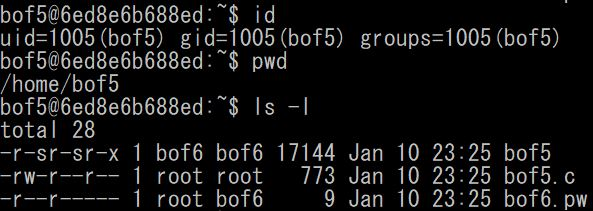
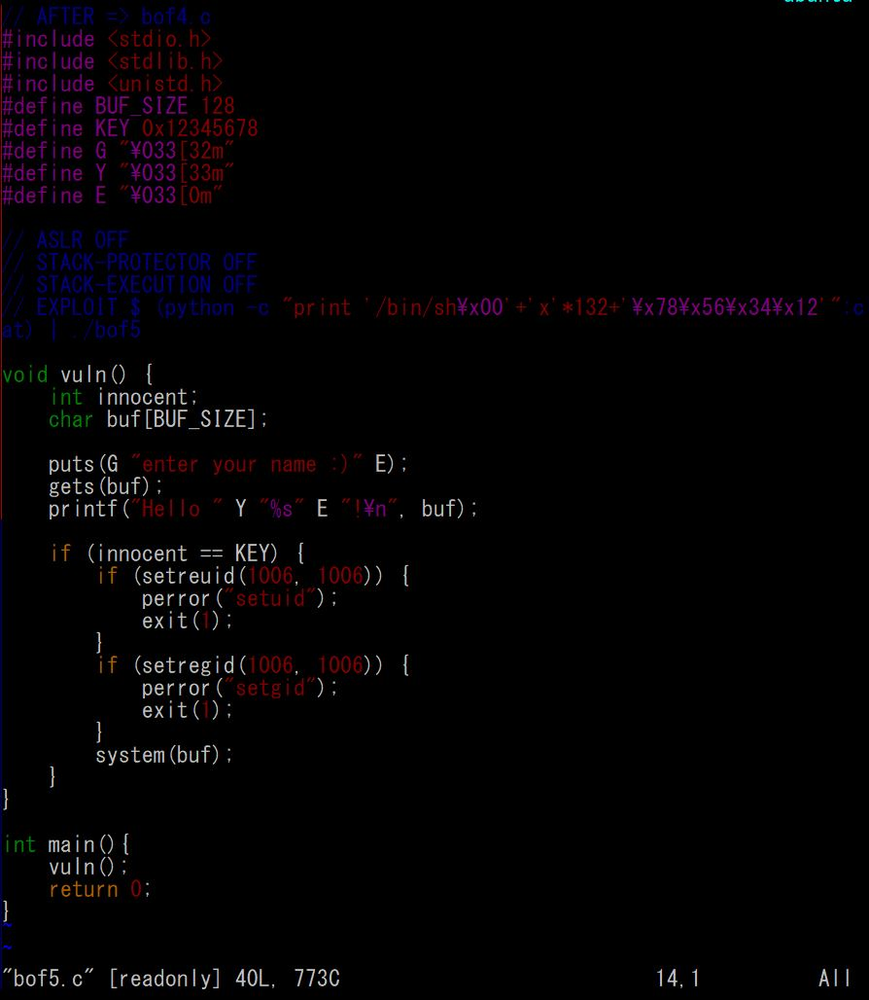
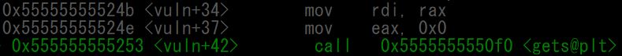
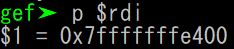
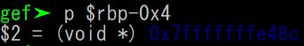
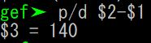
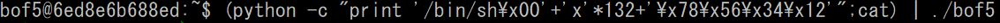
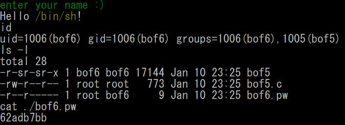

# bof5

## 개요

  
bof5로 접속하면 home directory에 <code>bof5</code>, <code>bof5.c</code> 파일과 bof6의 비밀번호가 있는 <code>bof6.pw</code> 파일이 있다.  
<code>bof5.pw</code>를 읽기 위해서는 bof5의 권한이 필요한데, 마침 <code>bof4</code>파일이 bof5권한으로 실행되므로 이 프로그램을 이용해보도록 하자.  

## 소스코드
  
코드를 분석해보면 <code>gets(buf)</code>로 <code>buf</code>에 대한 값을 받아 출력하고, <code>innocent</code>의 값이 KEY(= 0x12345678)와 같을 때 <code>system(buf)</code>을 실행하여 <code>buf</code>의 내용으로 <code>system()</code> 함수를 실행한다.  

이 때 buf에는 쉘 실행 명령<code>/bin/sh/</code>을 넣고, <code>innocent</code>가 <code>buf</code>보다 먼저 정의되어 있으니 <code>gets(buf)</code>에서 <code>buf</code>에 buffer overflow를 이용하여 <code>innocent</code>까지 덮어써 if문을 통과하면 쉘을 실행시킬 수 있을 것 같다. 

## buf와 innocent 사이 거리
gdb를 이용해 buf와 innocent의 주소를 찾아 거리를 구해보자.  
1. buf 주소  
  
  
<code>gets(buf)</code>에서 <code>buf</code>의 주소를 넘겨주므로, 이 때 $rdi를 보면 알 수 있다.  

2. innocent 주소  
  
  
<code>innocent</code>는 if문에서 비교할 때 사용되므로, <code>cmp</code>에서 비교하는 주소인 $rbp-0x4이다.  

3. buf - innocent 사이의 거리  
  
둘의 차이를 계산해보면 140byte 차이가 난다.

## innocent 조작하기  
우리가 이제 해야할 일은 <code>innocent</code>에 '0x12345678'을 넣어주고 <code>buf</code>에는 '/bin/sh\0'을 넣어주는 것이다.  
그러기 위해서는 <code>buf</code>에 '/bin/sh\0'으로 시작하는 140byte의 글자를 넣어주고, '0x12345678'을 little endian 방식으로 넣어주는 것이다.  
  
위처럼 입력해주면 아래와 같이 bof5파일로 쉘이 실행된다.  
  
