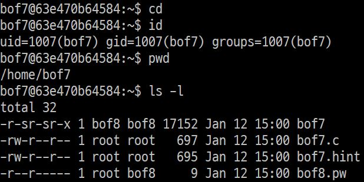
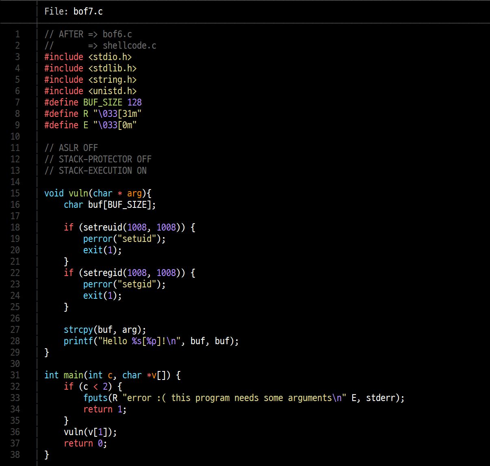
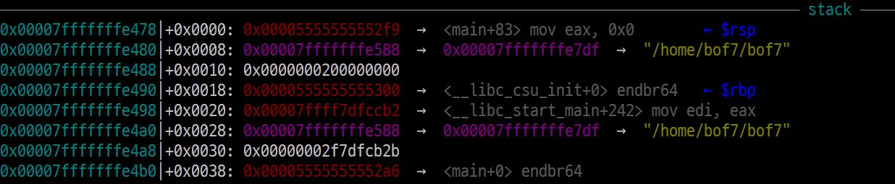
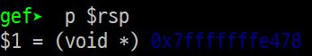
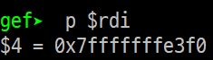
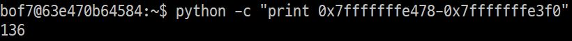
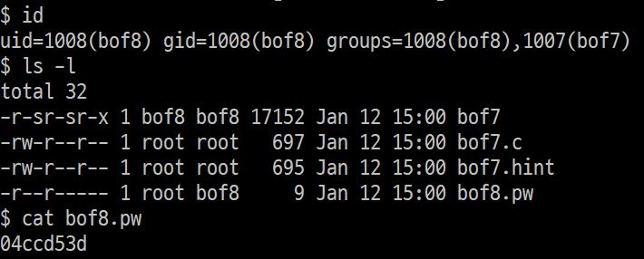

# bof7 문제해결

## 개요  

현재 나는 bof7의 id로 접속한 상태이고, bof8의 권한을 얻고싶은 상황이다.

  
bof7로 home directory를 보면 <code>bof7</code>, <code>bof7.c</code> 파일과 bof8의 비밀번호가 있는 <code>bof8.pw</code> 파일이 있다.  
bof8의 비밀번호는 <code>bof8</code>파일에 저장되어 있다. 그러나, <code>bof8.pw</code>를 읽기 위해서는 bof8의 권한이 필요한데, 마침 <code>bof7</code>파일이 bof8권한으로 실행되므로 이 프로그램을 이용해보도록 하자.  

## 소스코드
 bof7.c 코드  
코드를 분석해보면 <code>vuln()</code> 함수로 들어가 argument로 받은 값을 <code>strcpy()</code>함수를 이용하여 <code>buf</code>에 옮긴 뒤, <code>buf</code>를 출력한다.  

이 때 <code>vuln</code>함수로 들어간다는 점을 이용해 stack에 저장되어 있는 return하는 주소를 shell code가 적혀있는 주소로 바꿔주면 bof8권한으로 쉘을 실행시킬 수 있을 것 같다. <code>strcpy</code>함수의 overflow로 return 주소를 바꿔보자.  

## buf와 return address 사이 거리
gdb를 이용해 buf와 return address가 저장된 곳의 거리를 구해보도록 하자  

1. return address 저장 주소  
 stack에 저장된 return 주소  
 $rsp 값  
<code>vuln</code>함수에 들어오면 가장 먼저 return address를 stack에 저장한다. 이 값은 $rsp에 저장되어 있으므로 $rsp의 값을 읽었다.

2. buf 주소  
  
  
buf의 주소는 아래에서 <code>strcpy(buf, arg)</code>에서 <code>buf</code>의 주소를 사용하므로, 이 때 $rdi를 보면 알 수 있다.  

3. buf - innocent 사이의 거리  
  
둘의 차이를 계산해보면 136byte 차이가 난다.

## return address 조작하기  
우리가 이제 해야할 일은 return address에 shell code가 적혀있는 주소를 넣어주는 것이다.  
이 프로그램에서는 <code>buf</code>에 입력값을 넣어줄 수 있고, buf의 시작 주소를 알려주니 shell code를 buf에 넣어주고 buf의 시작주소로 return하도록 해주면 될 것 같다.  
 poc 입력    
위처럼 입력해주었는데, segmentation fault 오류가 발생하고, buf의 주솟값이 gdb에서 찾아낸 주소와 다르다. gdb로 실행할 때와 shell에서 바로 실행할 때는 stack주소가 다르기 때문에 주소가 바뀐 것 같다.  
 poc 입력2  
위처럼 주소를 적절하게 다시 바꿔 입력해주었다.  
  bof8 권한 탈취 성공!  
성공적으로 bof7파일을 통해 bof8의 권한으로 쉘을 실행시켜 bof8의 비밀번호를 알아냈다.