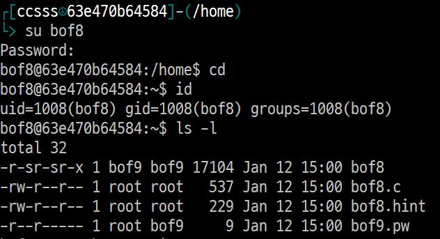
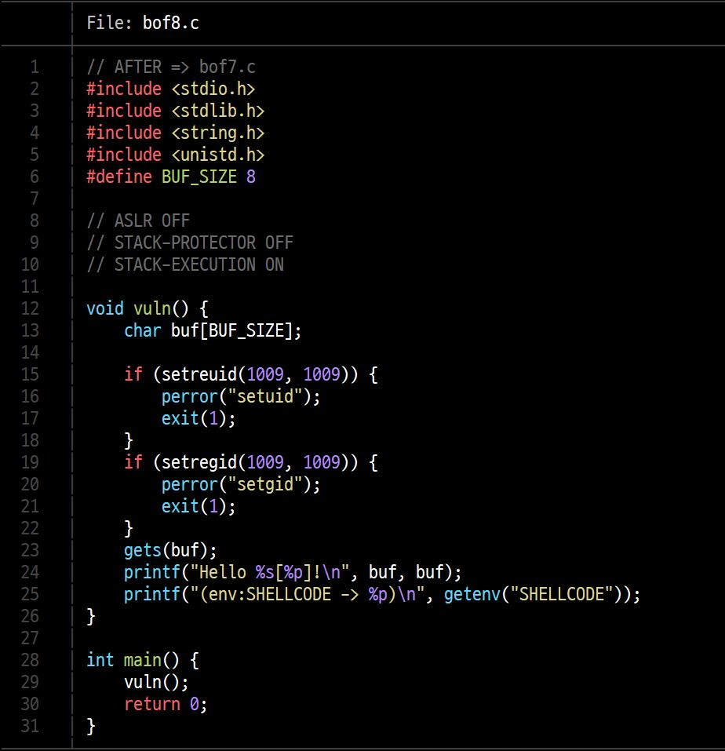
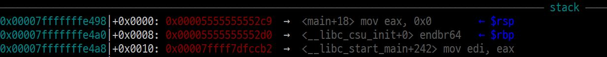
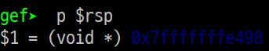
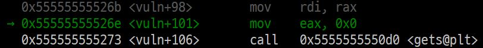
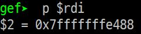
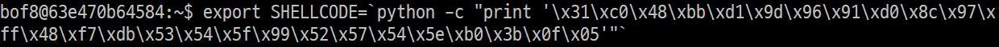
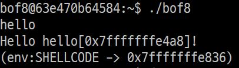
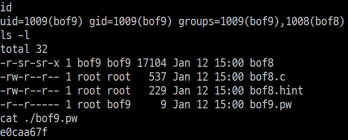

# bof8 문제해결

## 개요  

현재 나는 bof8의 id로 접속한 상태이고, bof9의 권한을 얻고싶은 상황이다.

  
bof7로 home directory를 보면 <code>bof7</code>, <code>bof7.c</code> 파일과 bof8의 비밀번호가 있는 <code>bof8.pw</code> 파일이 있다.  
bof8의 비밀번호는 <code>bof8</code>파일에 저장되어 있다. 그러나, <code>bof8.pw</code>를 읽기 위해서는 bof8의 권한이 필요한데, 마침 <code>bof7</code>파일이 bof8권한으로 실행되므로 이 프로그램을 이용해보도록 하자.  

## 소스코드
 bof8.c 코드  
코드를 분석해보면 <code>vuln()</code> 함수로 들어가 <code>gets</code>로 입력을 받아 <code>buf</code>에 저장하고 <code>buf</code>의 내용과 주소, 환경변수 <code>SHELLCODE</code>의 주소를 출력한다.  

이 때 <code>vuln</code>함수로 들어간다는 점을 이용해 stack에 저장되어 있는 return할 주소를 shell code가 적혀있는 주소로 바꿔주면 bof8권한으로 쉘을 실행시킬 수 있을 것 같다. <code>gets</code>함수의 overflow로 return 주소를 바꿔보자.  

## buf와 return address 사이 거리
gdb를 이용해 buf와 return address가 저장된 곳의 거리를 구해보도록 하자  

1. return address 저장 주소  
 stack에 저장된 return 주소  
 $rsp 값  
<code>vuln</code>함수에 들어오면 가장 먼저 return address를 stack에 저장한다. 이 값은 $rsp에 저장되어 있으므로 $rsp의 값을 읽었다.

2. buf 주소  
  
  
buf의 주소는 아래에서 <code>gets</code>에서 <code>buf</code>의 주소를 사용하므로, 이 때 $rdi를 보면 알 수 있다.  

3. buf - innocent 사이의 거리  
    - return address가 저장된 주소 0x7fffffffe498  
    - buf 주소 0x7fffffffe488  

    둘의 차이를 계산해보면 16byte 차이가 난다.  

## return address 조작하기  
우리가 이제 해야할 일은 return address에 shell code가 적혀있는 주소를 넣어주는 것이다.  
이 프로그램에서는 <code>buf</code>에 입력값을 넣어줄 수 있지만 shell code는 <code>\x31\xc0\x48\xbb\xd1\x9d\x96\x91\xd0\x8c\x97\xff\x48\xf7\xdb\x53\x54\x5f\x99\x52\x57\x54\x5e\xb0\x3b\x0f\x05</code>로 27byte이기 때문에 이번에는 buf에 넣어줄 수 없다. 대신 이번에는 환경변수 <code>SHELLCODE</code>의 주소를 출력하는 부분이 있으니 환경변수로 shell code를 미리 넣어주고 <code>SHELLCODE</code>의 주소로 return하면 될 것 같다.  
 환경변수 입력  
환경변수로 먼저 SHELLCODE를 입력해주었다.  
이 때 shell code는 byte단위로 encode되어 저장되어야 하기 때문에 python을 이용하여 입력해주었다.

 환경변수 입력 후 bof8 실행  
환경변수를 입력해주고 실행한 결과 <code>env</code> 함수에서 불러온 <code>SHELLCODE</code>값이 stack에 저장되고, 저장된 주소가 출력되었다.   
 poc 입력  
위처럼 입력으로 16byte를 채워주고, <code>SHELLCODE</code>의 주소를 넣어주어 return 주소를 바꾸면서 파일을 실행했다.  
  bof9 권한 탈취 성공!  
성공적으로 bof8파일을 통해 bof9의 권한으로 쉘을 실행시켜 bof9의 비밀번호를 알아냈다.