# bof10 풀이

## 개요

현재 bof9의 id로 접속한 상태이고, bof11의 권한을 얻고싶은 상황이다.

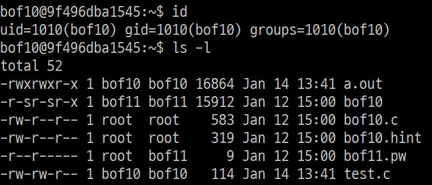  
bof10로 home directory를 보면 <code>bof10</code>, <code>bof10.c</code> 파일과 bof10의 비밀번호가 있는 <code>bof10.pw</code> 파일이 있다.  
<code>bof11.pw</code>를 읽기 위해서는 bof11의 권한이 필요한데, 마침 <code>bof10</code>파일이 bof11권한으로 실행되므로 이 프로그램을 이용해보도록 하자.

## 프로그램 분석  
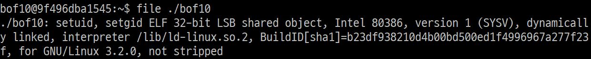  
file 명령을 통해 bof10파일을 분석해보니 x86 프로그램이다.  
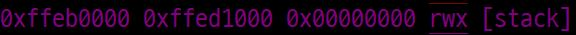  
gdb의 vmmap 명령으로 실행 권한을 확인해본 결과 NXbit가 적용되지 않아 .  
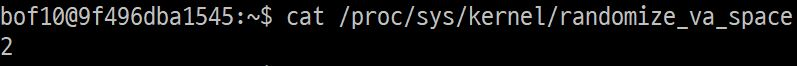  
또한 ASLR적용 여부를 확인해본 결과 적용이 돼있어 gdb로 구한 주소를 사용할 수 없다.

## 소스코드
  
코드를 분석해보면 <code>vuln()</code> 함수로 들어가 argument로 받은 값을 <code>strcpy()</code>함수를 이용하여 <code>buf</code>에 옮긴 뒤, <code>buf</code>와 그 주소를 출력한다. 또, 환경변수 <code>SHELLCODE</code>를   

이 때 <code>vuln</code>함수로 들어간다는 점을 이용해 stack에 저장되어 있는 return하는 주소를 shell code가 적혀있는 환경변수 <code>SHELLCODE</code> 주소로 바꿔주면 bof11권한으로 쉘을 실행시킬 수 있을 것 같다. <code>strcpy</code>함수의 overflow로 return 주소를 바꿔보자.  

## buf와 return address 사이 거리
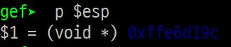  
return address는 <code>vuln</code> 함수가 call 되고 $esp에 저장되어있다.  

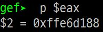  
strcpy의 저장할 주소 argument는 $eax에 저장 되어 있다.

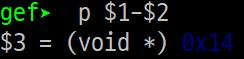  
따라서 둘의 거리는 14byte이다.  

## return address 조작하기  
buffer와 return address 사이의 거리가 14byte 이므로 payload로 'x' * 14와 SHELLCODE의 주소를 넣어줘야 한다.  
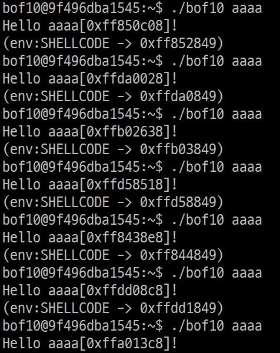  
그러나 ASLR이 적용되어 실행할 때마다 주소가 달라지기 때문에, 절대주소를 넣어줄 수 없다.

## SHELLCODE  
ASLR이 적용된 상황이기 때문에, <code>nop</code> 명령인 <code>0x90</code>을 SHELLCODE 앞에 넣어줘 어림짐작으로 SHELLCODE의 <code>nop</code> 중간 주소로 들어갈 수 있도록 유도하면 될 것이다.  
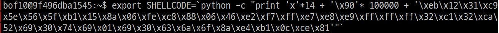  
위처럼 <code>nop</code> 명령을 10만개 정도 넣어주었다.

## brute-force로 ASLR 우회  
위처럼 <code>nop</code>가 있는 쉘코드를 넣어주고 적당한 시작지점을 넣어서 여러번 실행하다보면 <code>nop</code>에 걸려 결국 쉘코드가 실행될 것이다. 쉘에서 반복문으로 실행해보자.  

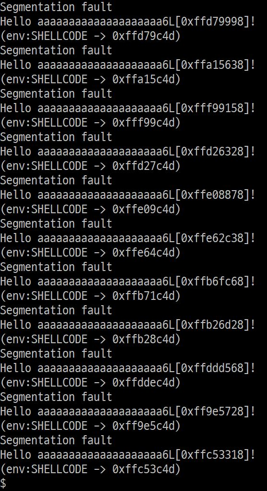  
여러번 실행한 결과 어느 순간 쉘이 실행되고 멈췄다.  

## 성공  
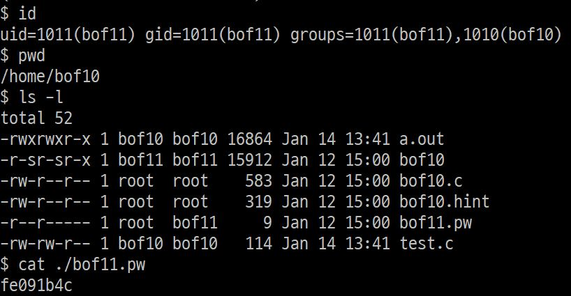  
실제로 위의 방법대로 쉘이 실행되어 권한 탈취에 성공했다.